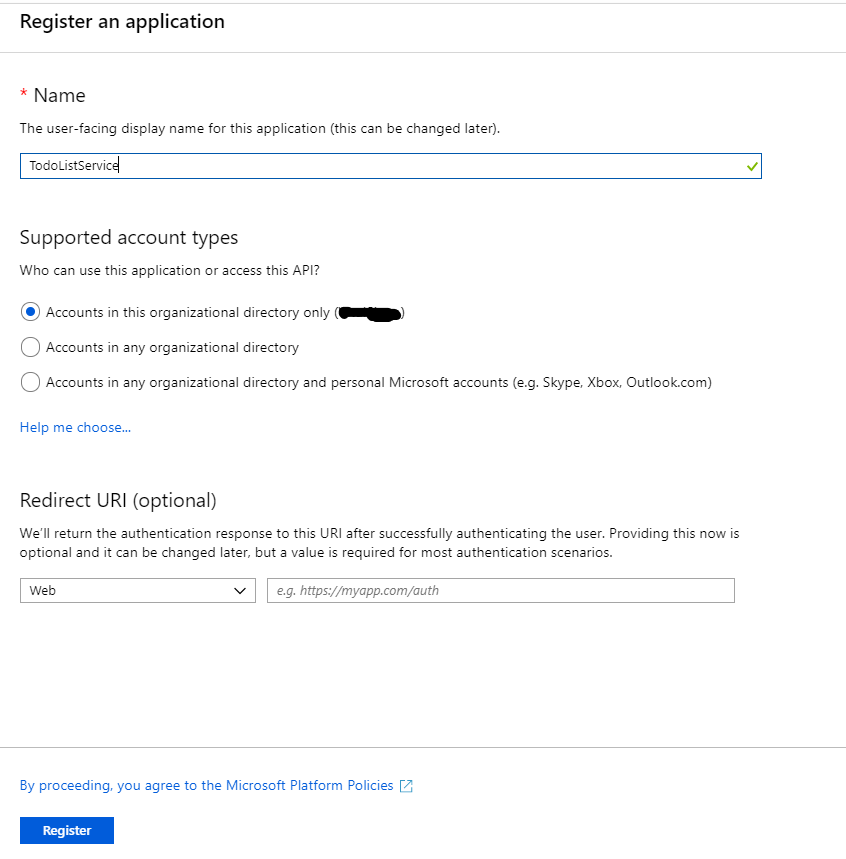
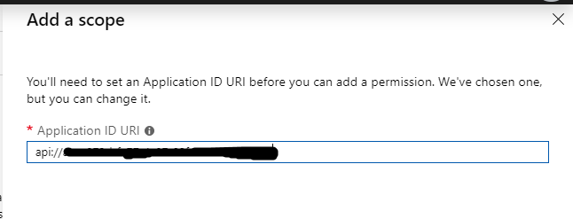
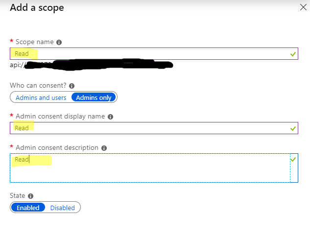
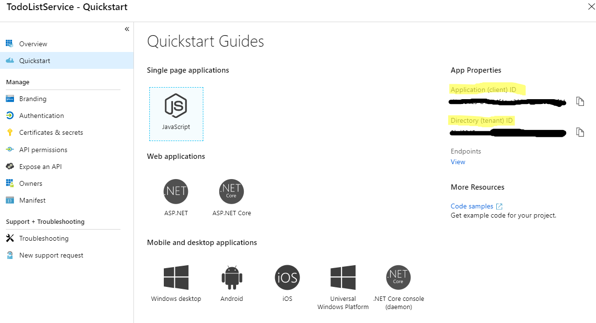
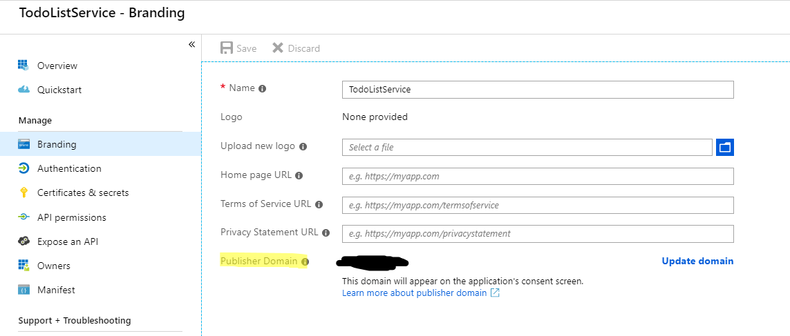
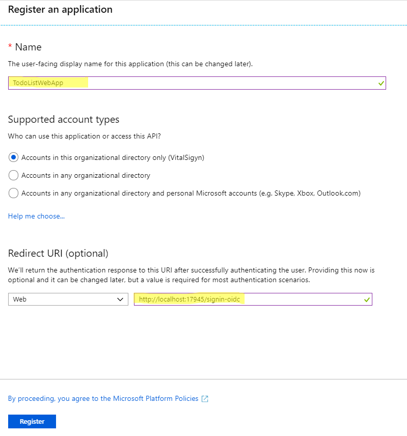
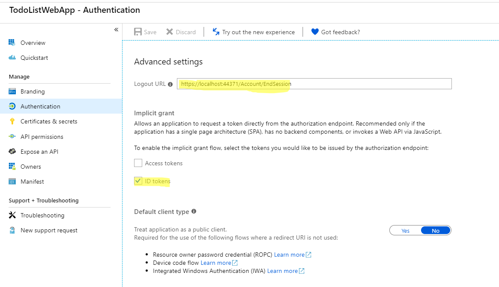
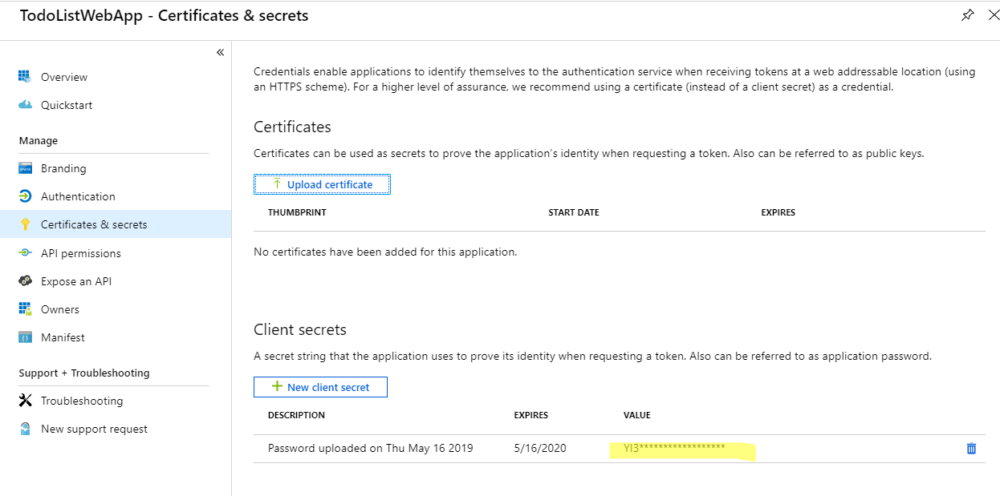
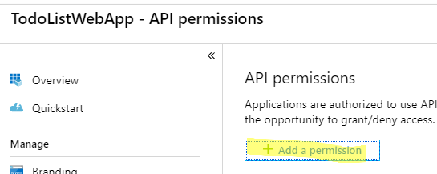
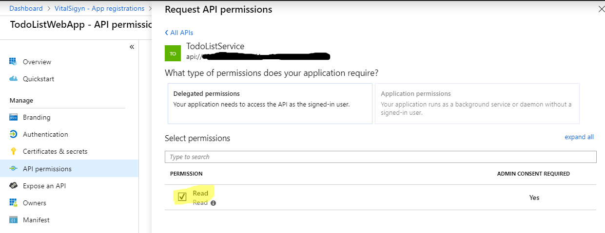

# Calling a web API in an ASP.NET Core web application using Azure AD
## About this sample
### Scenario
This sample contains a web API running on ASP.NET Core 2.0 protected by Azure AD. The web API is accessed by an ASP.NET Core 2.0 web application on behalf of the signed-in user. The ASP.NET Web application uses the OpenID Connect middleware and the Active Directory Authentication Library (ADAL.NET) to obtain a JWT bearer token for the signed-in user using the [OAuth 2.0](https://docs.microsoft.com/en-us/azure/active-directory/develop/active-directory-protocols-oauth-code) protocol. The bearer token is passed to the web API, which validates the token and authorizes the user using the JWT bearer authentication middleware.

### More information
For more information about how the protocols work in this scenario and other scenarios, see [Authentication Scenarios for Azure AD](http://go.microsoft.com/fwlink/?LinkId=394414).

> This sample has been updated to ASP.NET Core 2.0. Looking for previous versions of this code sample? Check out the tags on the [ASP.NET Core 1.0](../../tree/aspnet10) branch.

> This sample is for Azure AD v1.0. If you are looking for an Azure AD v2.0 sample (to sign-in users with Work and School accounts **and Microsoft Personal accounts**, please look at [active-directory-aspnetcore-webapp-openidconnect-v2](https://github.com/Azure-Samples/active-directory-aspnetcore-webapp-openidconnect-v2)

### User experience
The web API, **TodoListService**, maintains an in-memory collection of to-do items per authenticated user. The authenticated user carries the same to-do list across multiple instances of the web app in this sample as well as native clients like the [.NET native (WPF) client](https://github.com/Azure-Samples/active-directory-dotnet-native-aspnetcore).

The ASP.NET Core 2.0 web app, **TodoListWebApp** enables a user to:
- Sign in. The first time a user signs in, a consent screen prompts the user for permission to access **TodoListService** and obtain user profile information from Azure Active Directory. Since this is a web app, hosted in a browser, it can be that the user gets immediately signed-in benefiting from Single Sign On with other web applications. 
- Select **Todo List** in the app's navigation bar. The user may then:
    - See the list of to-do items exposed by Web API for the signed-in identity,
    - Add more to-do items (buy clicking on Add item).
- Sign out.

On subsequent returns to the web app, the user's session is persisted locally in a cookie and reauthentication is not required.


## Running the sample

> [!NOTE] 
> If you want to run this sample on **Azure Government**, see the "Azure Government Deviations" section at the bottom of this page.


### Pre-requisites

- [.NET Core for Windows](https://www.microsoft.com/net/learn/get-started/windows#windows)
- [Visual Studio 2017](https://aka.ms/vsdownload)
- An [Azure Active Directory (Azure AD) tenant](https://azure.microsoft.com/documentation/articles/active-directory-howto-tenant/)
- A [user account in the Azure AD tenant](https://docs.microsoft.com/azure/active-directory/add-users-azure-active-directory) This sample will not work with a Microsoft account (formerly Windows Live account).

### Step 1: Clone or download this repository

From your shell or command line:

```sh
git clone https://github.com/Azure-Samples/active-directory-dotnet-webapp-webapi-openidconnect-aspnetcore.git
```

### Step 2: Register the sample with the Azure Active Directory tenant

There are two projects in this sample.  Each needs to be registered in your Azure AD tenant.

#### Register the **TodoListService** web API

1. Sign in to the [Azure portal](https://portal.azure.com).
2. On the top bar, click on the signed-in account. Under **Directory**, select the Azure AD tenant where the app will be registered.
3. In the navigation on the left, select **More Services >**. Scroll down and select **Azure Active Directory**.
4. Select **App registrations** and then select **+ New registration**.
5. Enter *TodoListService* for **Name**. Select "Accounts in this organization directory only' option (should be selected by default). Select the **Register** button to create the app registration. 



6. From the **Expose an API** blade, select **+ Add a scope**. You will be prompted to enter an Application ID URI before you can add a scope. Accept the default value of "api://{application_id}" and select the **Save and continued** button.



7. then under **Scope name** enter "Read". Enter "Read" into **Admin consent display name** and **Admin consent description**. press **Add scope**.



8. From the list of app registrations, select the newly created application, select **Quickstart**, Note the following information for reference in later steps:
    - **Application (client) ID**
    - **Directory (tenant) ID**
	


9. From the list of app registrations, select the newly created application, select **Branding**. Take note of the **Publisher Domain**, such as `contoso.onmicrosoft.com`.



> [!NOTE]
> By default, the list of app registrations is filtered to *My apps*. To see the app that was just registered, select *All apps*. in the filter dropdown near the top of the blade.

#### Register the TodoListWebApp web application

1. Return to the list of app registrations. Select **+ New registration**.
2. Enter *TodoListWebApp* for **Name**. Select "Accounts in this organization directory only' option (should be selected by default). For **Redirect URI**, enter the base URL for the sample web app project (by default `http://localhost:17945/signin-oidc`). Select the **Create** button to create the app registration.  



3. From the list of app registrations, select the newly created application, select **Quickstart**. Note the **Application ID** for reference in later steps.


4. From the **Authentication** blade, under **Advanced settings** set the `Logout Url` property to `https://localhost:44371/Account/EndSession`. Under **implicit grant**, check the "ID tokens" checkbox. Select **Save**. 



5. From the **Certificates & secrets** blade, select **New client Secret**. Add a new key by entering a key description and duration of either 1 year or 2 years. Select **Save**. Note the displayed key value for later steps. Be sure the key value is copied correctly, as it is will not be displayed again. Should the key value be lost, a new key must be created. 



6. From the **API permissions** blade, select **+ Add a permission**, then under **Select an API** select "My APIs" and Type *TodoListService* in the textbox and press **Enter**. Select the web API from the list. Then under **Select Permissions** check the **Read** permission. Then select the **Add permission** button then select **Grant admin consent for {Your Tenant}** button and select **Yes**. Once the web app is granted access to the webapi you should see the following message: *Successfully granted permissions to the application for your account. To grant permissions for all users, please have an admin consent to the application.*





### Step 3: Configure the sample to use the Azure AD tenant

#### Configure the TodoListService project

1. Open the solution in Visual Studio.
1. In the **TodoListService** project, open the `appsettings.json` file.
1. Find the `Domain` property and replace the value with the AAD tenant domain.
1. Find the `TenantId` property and replace the value with the **Tenant ID**. 
1. Find the `ClientId` property and replace the value with the **Application ID** property of the TodoListService application.

#### Configure the TodoListWebApp project

> [!WARNING]
> Follow these steps carefully. The **Application ID** property of both app registrations are used below.

1. In the **TodoListWebApp** project, open the `appsettings.json` file.
1. Find the `Domain` property and replace the value with the AAD tenant domain.
1. Find the `TenantId` property and replace the value with the **Tenant ID**. 
1. Find the `ClientId` property and replace the value with the **Application ID** of the *TodoListWebApp* app.
1. Find the `ClientSecret` and replace the value with the key value for the *TodoListWebApp* app.
1. Find the `TodoListResourceId` property and replace the value with the **Application ID** of the *TodoListService* app

### Step 4: Run the sample

In the solution properties, set both projects as startup projects. Set **TodoListService** to run first. Clean the solution, rebuild it, and then run it.  

On startup, the web API displays an empty web page. This is expected behavior.

Explore the sample by signing in into the web app, clicking on "Todo List", signing again if needed, adding items to the To Do list, signing-out, and starting again.  Since the authenticated session is stored in a cookie, the application doesn't require logging in again if the previous session was never signed out.

> [!NOTE]
> The To Do list is stored in memory in this sample. Each time the TodoListService API is stopped, any to-do lists are reset.

## How was the code created?
### Code for the service
The code for the service is exactly the same as the service used in the [active-directory-dotnet-native-aspnetcore](https://github.com/Azure-Samples/active-directory-dotnet-native-aspnetcore#how-the-code-was-created) sample. Please refer to that sample for more information.

### Code for ASP.NET Web App
The code for the ASP.NET web app is based on the code of the [active-directory-dotnet-webapp-openidconnect-aspnetcore](https://github.com/Azure-Samples/active-directory-dotnet-webapp-openidconnect-aspnetcore) sample. Please read the "About The code" section of that sample first.

Then, based on that code, the following modifications were applied. [This commit](https://github.com/Azure-Samples/active-directory-dotnet-webapp-webapi-openidconnect-aspnetcore/pull/24/commits/2ce2750dfd172f9297c2d1885cccdd6b66cc7529) details the incremental changes described below:
- Update of the AzureAdOptions class to add a property to compute the `Authority` from the `instance` and the `tenantID`, and adding two other configuration options for `ClientSecret`,  the `resourceId` of TodoListService (its clientId) and the base address for this service.
- Added a `TodoListItem` in models to deserialize the Json sent by the TodoListService
- Added a `NaiveSessionCache` class in a new Utils folder which serves as a token cache which livetime is the duration of the session. Updated the `Startup.cs` file accordingly to add sessions.
- Added a `TodoListController` and a `Todo` view, as well as a "Todo List" entry in the toolbar of the Web API. This is where most of the interesting code is
- Updated the `SignOut()` method of the `AccountController` to clear the cache for the user when s/he signs-out.
- Updated `AzureAdAuthenticationBuilderExtensions.cs` to request an authorization code, and redeem it, getting an access token to the Azure AD graph (https://graph.windows.com), so that the token cache contains a token for the user. This token will be used by the `TodoController` to request another token for the TodoListService

This scenario is slightly different than the same scenario in ASP.NET (not Core).  Note the following line in *AzureAdAuthenticationBuilderExtensions.cs*:

```csharp
options.ResponseType = "id_token code";
```

Unlike ASP.NET, ASP.NET Core 2.0 uses an implicit flow by default. Without overriding the response type (default *id_token*), the `OnTokenValidated` event is fired instead of `OnAuthorizationCodeReceived`. The line above requests **both** *id_token* and *code*, so that `OnTokenValidated` is called first. This ensures that `context.Principal` has a non-null value representing the signed-in user when `OnAuthorizeationCodeReceived` is called.

### How to change the app URL
If you are using Visual Studio 2017
1. Edit the TodoListService's properties (right click on `TodoListService.csproj`, and choose **Properties**)
1. In the Debug tab:
    1. Check the **Launch browser** field to `https://localhost:44351/api/todolist`
    1. Change the **App URL** field to be `https://localhost:44351` as this is the URL registered in the Azure AD application representing our Web API.
    1. Check the **Enable SSL** field

The same kind of modifications can be made on the `TodoListWebApp.csproj` project.

> [!WARNING]
> Ensure that all of the app registration steps reflect any changes made to the URLs, or the sample won't function.

### What to change when you deploy the sample to Azure
To this sample to Azure:
- Update the various URLs (reply URLs, Base URL) in the *appsettings.json* files
- Add Reply URLs pointing to the deployed location, for  both applications in the Azure portal

### Azure Government Deviations

In order to run this sample on Azure Government you can follow through the steps above with a few variations:

- Step 2: 
   - You must register this sample for your AAD Tenant in Azure Government by following Step 2 above in the [Azure Government portal](https://portal.azure.us). 
- Step 3: 
    - Before configuring the sample, you must make sure your [Visual Studio is connected to Azure Government](https://docs.microsoft.com/azure/azure-government/documentation-government-get-started-connect-with-vs).     
    - Navigate to the appsettings.json files for both the TodoListService web API and TodoListWebApp web application. Replace the "Instance" property in the Azure AD section with `https://login.microsoftonline.us/`. 
    
Once those changes have been accounted for, you should be able to run this sample on Azure Government.


## Related content
### Other documentation / samples
The scenarios involving Azure Active directory with ASP.NET Core are described in ASP.Net Core | Security | Authentication | [Azure Active Directory](https://docs.microsoft.com/en-us/aspnet/core/security/authentication/azure-active-directory/). From this page, you can access the related samples
